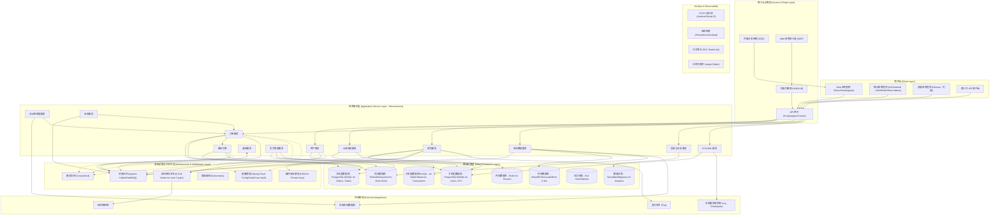

```mermaid
graph TD
    subgraph "用户端 [Client Layer]"
        WebApp["Web 应用程序 (React/Vue/Angular)"]
        MobileApp["移动应用程序 (iOS/Android - Swift/Kotlin/React Native)"]
        DesktopApp["桌面应用程序 (Electron - 可选)"]
        APIClients[第三方 API 客户端]
    end

    subgraph "接入与边缘层 [Access & Edge Layer]"
        CDN["内容分发网络 (CDN)"]
        WAF["Web 应用防火墙 (WAF)"]
        APIGateway["API 网关 (Kong/Apigee/Custom)"]
        LoadBalancers["负载均衡器 (NLB/ALB)"]
    end

    subgraph "应用服务层 [Application Service Layer - Microservices]"
        UserService[用户服务]
        AuthService[认证授权服务]
        WalletService[钱包服务]
        OrderService[订单服务]
        MatchingEngine[撮合引擎]
        MarketDataService[市场数据服务]
        NotificationService[通知服务]
        KYCService[KYC/AML 服务]
        AdminService[后台管理服务]
        ReportingService[报表与分析服务]
        LiquidityService[流动性管理服务]
        RiskControlService[风控服务]
    end

    subgraph "数据存储层 [Data Persistence Layer]"
        UserDB[("关系型数据库 - PostgreSQL/MySQL for Users, KYC")]
        TradingDB[("关系型数据库 - PostgreSQL/MySQL for Orders, Trades")]
        WalletDB[("关系型数据库/NoSQL - for Wallet Balances, Transactions")]
        MarketDataDB[("时序数据库 - InfluxDB/TimescaleDB for K-line")]
        OrderBookCache[("内存数据库 - Redis/Memcached for Order Book")]
        SessionCache[("内存数据库 - Redis for Session")]
        LogStorage[("日志存储 - ELK Stack/Splunk")]
        DataWarehouse[("数据仓库 - Snowflake/BigQuery for Analytics")]
    end

    subgraph "基础设施与中间件层 [Infrastructure & Middleware Layer]"
        MessageQueue["消息队列 (Apache Kafka/RabbitMQ)"]
        BlockchainInteractors["区块链交互节点 (Full Nodes for each Crypto)"]
        HSM["硬件安全模块 (HSM for Private Keys)"]
        ContainerOrchestration["容器编排 (Kubernetes)"]
        ServiceDiscovery["服务发现 (Consul/etcd)"]
        ConfigManagement["配置管理 (Spring Cloud Config/HashiCorp Vault)"]
    end

    subgraph "外部集成 [External Integrations]"
        PaymentGateways["支付网关 (Fiat)"]
        BlockchainNetworks[区块链网络]
        MarketDataProviders[外部市场数据源]
        ComplianceProviders["合规服务提供商 (e.g., Chainalysis)"]
    end

    %% 连接关系
    WebApp --> APIGateway
    MobileApp --> APIGateway
    DesktopApp --> APIGateway
    APIClients --> APIGateway

    CDN --> WebApp
    WAF --> LoadBalancers
    LoadBalancers --> APIGateway

    APIGateway --> UserService
    APIGateway --> AuthService
    APIGateway --> WalletService
    APIGateway --> OrderService
    APIGateway --> MarketDataService
    APIGateway --> ReportingService
    APIGateway --> KYCService

    UserService --> UserDB
    UserService --> MessageQueue
    AuthService --> UserDB
    AuthService --> SessionCache
    WalletService --> WalletDB
    WalletService --> BlockchainInteractors
    WalletService --> HSM
    WalletService --> MessageQueue
    OrderService --> TradingDB
    OrderService --> OrderBookCache
    OrderService --> MatchingEngine
    OrderService --> MessageQueue
    MatchingEngine --> TradingDB
    MatchingEngine --> OrderBookCache
    MatchingEngine --> MessageQueue
    MarketDataService --> MessageQueue
    MarketDataService --> MarketDataDB
    MarketDataService --> OrderBookCache
    MarketDataService --> MarketDataProviders
    NotificationService <--> MessageQueue
    KYCService --> UserDB
    KYCService --> ComplianceProviders
    AdminService --> UserDB
    AdminService --> TradingDB
    AdminService --> WalletDB
    ReportingService --> DataWarehouse
    LiquidityService --> MarketDataProviders
    LiquidityService --> OrderService
    RiskControlService --> MessageQueue
    RiskControlService --> OrderService

    BlockchainInteractors --> BlockchainNetworks
    WalletService --> PaymentGateways

    %% 通用组件
    subgraph DevOps & Observability
        CI_CD["CI/CD 流水线 (Jenkins/GitLab CI)"]
        Monitoring["监控系统 (Prometheus/Grafana)"]
        Logging["日志聚合 (ELK Stack/Loki)"]
        Tracing["分布式追踪 (Jaeger/Zipkin)"]
    end

    UserService -.-> ServiceDiscovery
    OrderService -.-> ServiceDiscovery
    MatchingEngine -.-> ServiceDiscovery
    WalletService -.-> ConfigManagement
    OrderService -.-> ConfigManagement


```