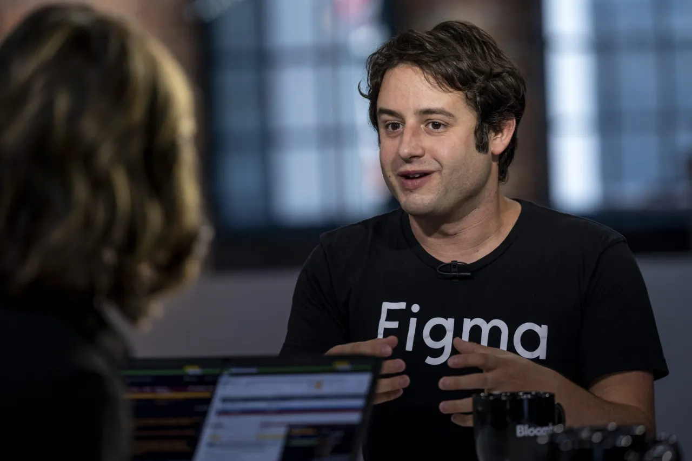

设计软件"独角兽"公司Figma已秘密提交首次公开募股(IPO)申请。此前Adobe公司对其200亿美元的收购要约因反垄断监管问题于一年多前宣告失败。

美国总统特朗普推动实施的关税了引发华尔街市场动荡，不确定性不仅使投资者感到不安，也让市场对诸多新股发行项目近期的可行性产生重大疑虑。但 Figma 此次上市申请却显露出对于企业公开上市的乐观预期。

Figma周二宣布，已向美国证券交易委员会（SEC）提交了首次公开募股（IPO）申请文件的草案，但未公开完整版本的文件——这类文件通常包含公司运营的财务细节。

Figma最终在公开市场寻求的估值将是一个值得关注的看点。在低利率助推风投热潮的2021年，Figma E轮融资估值达到100亿美元。2024年，Figma通过股权回购要约将公司估值推高至125亿美元。

Figma的投资者包括凯鹏华盈（Kleiner Perkins）、红杉资本（Sequoia Capital）、Greylock、指数创投（Index Ventures）、创始人基金（Founders Fund）等多家知名风投机构。

目前 Figma 公司拥有约1600名员工，客户涵盖数百万用户及企业，客户名单中包括爱彼迎、谷歌、微软、奈飞（Netflix）、Salesforce、声田（Spotify）、Square、Stripe和Zoom等科技巨头。Figma的业务具有显著的国际化特征，其85%的用户位于美国境外。

2024年5月，Figma向CNBC披露其年度经常性收入（ARR）已达到6亿美元，首度公开部分核心财务数据。ARR作为衡量企业基于长期合约与订阅制模式的稳定收入的重要指标，对众多公司具有关键参考价值。

这家由迪伦·菲尔德（Dylan Field）与伊万·华莱士（Evan Wallace）于2012年联合创立的企业近年备受关注，焦点既包括对其IPO进程的持续预期，也涉及Adobe天价收购计划流产后的发展动向。（两位创始人相识于布朗大学就读期间，并由此开启创业之路。）

2022年，Adobe宣布计划收购Figma，但该交易遭遇严格监管审查，其中包括欧盟委员会的调查。最终在2023年，两家公司放弃了这笔交易，Adobe向Figma支付了10亿美元的终止费。